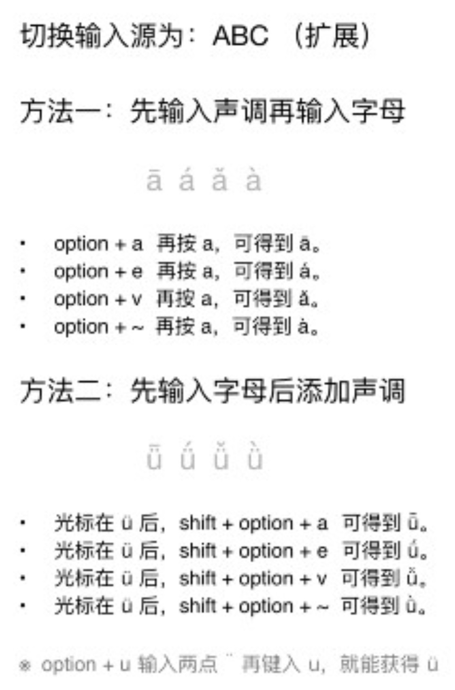

# growth15.github.io
---

## 音频转码

```bash
$ brew install ffmpeg
$ ffmpeg -i xxx.m4a -f ogg  -acodec libvorbis -ac 2 -ab 128k -ar 44100 xxx.ogg
```
   
可以使用如下命令测试 amr 到 mp3 的转码：

```bash
$ ffmpeg -i xxx.m4a xxx.mp3
```

## 音频播放

```html
<audio controls="controls">
  <source src="https://firebasestorage.googleapis.com/v0/b/growth15-a8c59.appspot.com/o/2017%2F06%2F07%2Frabbit.ogg?alt=media&amp;token=ac80f67e-26e2-4d2d-a6e8-b17bb0a25f75" type="audio/ogg" />
  <source src="https://firebasestorage.googleapis.com/v0/b/growth15-a8c59.appspot.com/o/2017%2F06%2F07%2Frabbit.mp3?alt=media&amp;token=2cbc35d2-0dc2-4951-b7d7-1e099c73fd38" type="audio/mpeg" />
您的浏览器不支持播放音频
</audio>
```

## 视频转码

```bash
$ ffmpeg -i  xxx.mov xxx.mp4

$ brew install ffmpeg2theora
$ ffmpeg2theora xxx.mov -o xxx.ogv
```

```html
<video controls="controls">
  <source src="https://firebasestorage.googleapis.com/v0/b/growth15-a8c59.appspot.com/o/2017%2F06%2F08%2Fbike.mp4?alt=media&token=33a6ce5a-bd1c-4cb9-9f93-05e695485420" type="video/mp4">
  <source src="xxx.ogv" type="video/ogg">
您的浏览器不支持播放视频
</video>
```

## 输入汉语拼音音调

完整的支持四声调的拼音首先需要添加并选择输入源「ABC（扩展）」。输入时先输入声调，然后输入元音字母（先声调再元音），例如：option + `，再按 o，可得到 ò。

1、2、3、4 声调分别对应的组合按键是： option + a、e、v、`。

元音: a、o、u、i、u、ü。

ü: option+u+u

* option + a，再按 a，可得到 ā。
* option + e，再按 a，可得到 á。
* option + v，再按 a，可得到 ǎ。
* option + `，再按 a，可得到 à。


